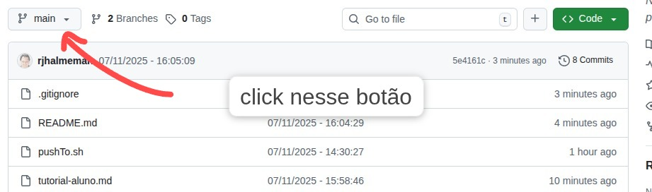

## TUTORIAL ALUNO

# 🎓 Tutorial Aluno - Como Baixar seu Projeto Corrigido

## Método 1: Download Direto (Mais Fácil)

### 1. ACESSAR SEU PROJETO
- Vá para: https://github.com/rjhalmeman/atendimentos

- Clique no botão "branches" 



### 2. ENCONTRAR SUA BRANCH
- Procure pela branch com seu nome: `seuNome`
- Clique nela

### 3. BAIXAR O PROJETO
- Clique no botão verde "<> Code"
- Selecione "Download ZIP"
- Extraia o ZIP em sua pasta de projetos

## Método 2: Git na Linha de Comando

```bash
# Clone o repositório
git clone https://github.com/rjhalmeman/atendimentos

# Entre na pasta
cd atendimentos

# Veja todas as branches disponíveis
git branch -a

# Mude para sua branch
git checkout seuNome

```

## Método 3: Usando sua conta git para enviar para o professor

### 🚀 Guia de Submissão de Projeto para Alunos

Este tutorial ensinará como enviar seu projeto de forma organizada, garantindo que o professor possa corrigi-lo sem problemas.

## ⚠️ Pré-requisitos

1.  **Git Instalado:** Você deve ter o Git instalado no seu computador.
2.  **Conta GitHub:** Você precisa ter uma conta no GitHub.
3.  **Repositório Clonado:** Você deve ter uma cópia local do repositório do professor (`rjhalmeman/atendimentos`).

## Passo 1: 🔗 Clonar o Repositório

Abra o seu terminal (ou Git Bash) e use o comando `git clone` para baixar o repositório.

```bash
git clone [https://github.com/rjhalmeman/atendimentos.git](https://github.com/rjhalmeman/atendimentos.git)


cd atendimentos
``` 

Passo 2: 🌿 Criar sua Branch (Ramificação)

É obrigatório que você trabalhe em uma branch separada para o seu projeto. Isso isola seu código e facilita a correção.

Regra de Nomenclatura: A branch deve ser nomeada como projeto-aluno-<seu-nome-e-sobrenome> (usando hífens e letras minúsculas).

Exemplo: Se seu nome é João Silva, sua branch será: projeto-aluno-joao-silva

Crie e mude para a sua branch em um único comando:

```bash

# SUBSTITUA 'seu-nome-e-sobrenome' pelo seu nome real
git checkout -b projeto-aluno-seu-nome-e-sobrenome

``` 

Passo 3: Adicionar seu Projeto
Crie uma pasta dentro de projetos/ com seu nome, seguindo o mesmo padrão da sua branch.

Exemplo: Se você está na branch projeto-aluno-joao-silva, crie a pasta projetos/aluno-joao-silva/.

Copie TODOS os arquivos do seu projeto finalizado para dentro desta pasta.

Passo 4: Adicionar, Comitar e Enviar (Push)
Agora você vai salvar as alterações no Git e enviá-las para o GitHub.

Adicionar Alterações: Informe ao Git quais arquivos novos ou modificados ele deve rastrear.

```bash 

git add .
``` 
Comitar (Salvar uma Versão): Salve um "instantâneo" do seu trabalho com uma mensagem descritiva.

```bash 

git commit -m "Projeto finalizado: Nome do seu projeto"
``` 

Enviar para o GitHub (Push): Envie sua branch e seu código para o repositório remoto.

```bash 

git push origin projeto-aluno-seu-nome-e-sobrenome

(O Git pode pedir a você para copiar e colar um comando um pouco mais 
longo na primeira vez; siga a instrução do terminal).

``` 

Passo 5: Criar o Pull Request (PR)

O Pull Request é o que notifica o professor de que seu projeto está pronto para correção.

Vá para a página do repositório no GitHub: https://github.com/rjhalmeman/atendimentos.

O GitHub geralmente mostra um aviso como "Compare & pull request" (Comparar e solicitar pull) após você ter feito o git push. Clique nele.

Confirme a Base: Certifique-se de que o "base" (destino) seja main e o "compare" (sua origem) seja a sua projeto-aluno-seu-nome-e-sobrenome branch.

Escreva uma Descrição e clique em "Create pull request" (Criar pull request).

Pronto! O professor será notificado e fará a correção no seu PR. Fique atento aos comentários!